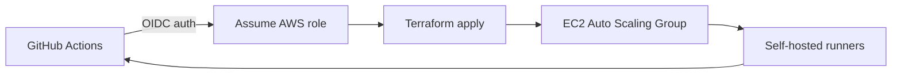

# CI infrastructure overview

## terraform apply steps

1. **OIDC role** – ensure GitHub Actions can assume the AWS role via OpenID Connect.
2. **Auto Scaling Group (ASG)** – apply the module that provisions the runner instances.
3. **Autoscaler** – deploy the Lambda or controller that scales instances based on queue depth.

## Cost notes

- Target **Spot** instances to minimize compute cost.
- Configure scaling policies so the group can **scale to zero** when idle.

## Adding a new suite

1. Edit `expected-suites.yml` with the new suite name.
2. Allow the discovery job to regenerate lists automatically.
3. Verify the guard step passes in CI to ensure the suite is recognized.
